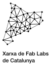
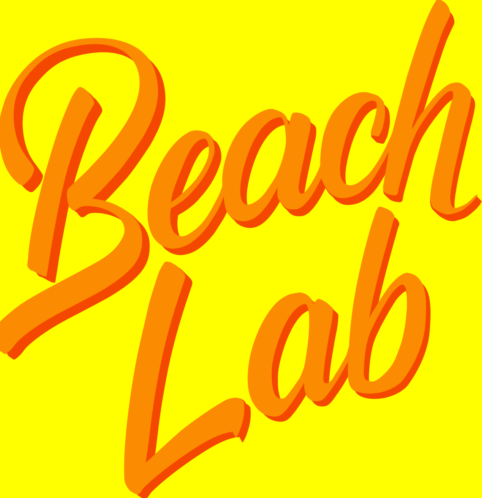
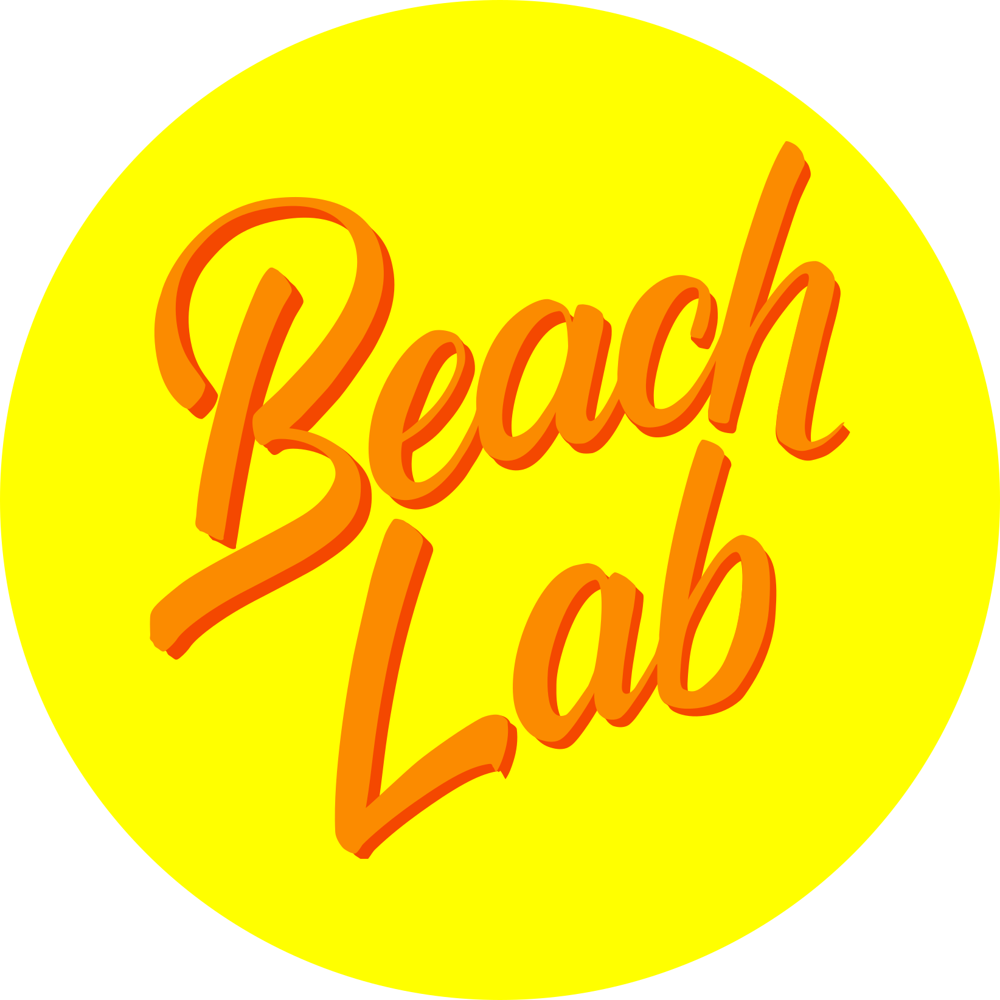
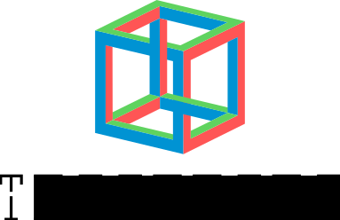
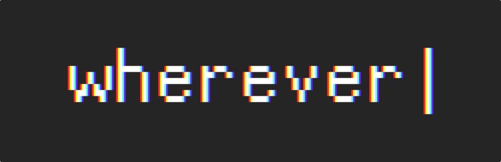
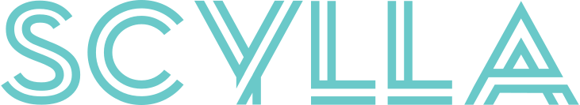

# Designs

A repository with some of my graphic designs (logos et al.)

## Xarxa de Fab Labs de Catalunya

Made with [Helvetica Neue](https://www.fonts.com/font/linotype/neue-helvetica)

## Fabcat

A second version of the logo.

## Beach Lab official logo

Created by Max Rippo, color scheme by Francisco Sanchez

Round version:

## Tesseract Logo

Uses the typography [Stenciles.ttf](tesseract/Stenciles.ttf)

## wherever

Using an additive light properties in Inkscape. Original SVG [here](wherever/wherever.svg), it cannot be seen on the browser.

## Scylla

Project name of an autonomous submarine.

